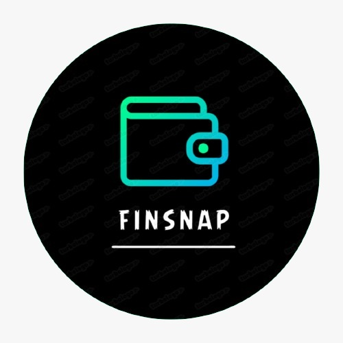
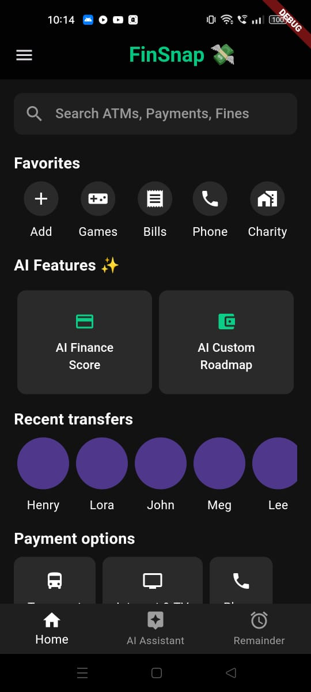
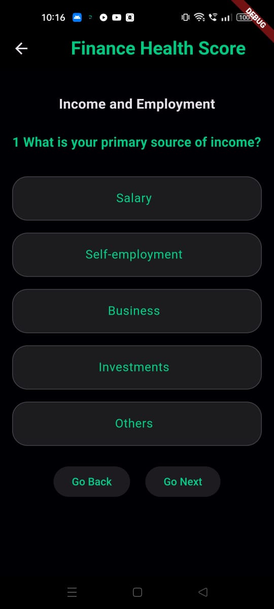
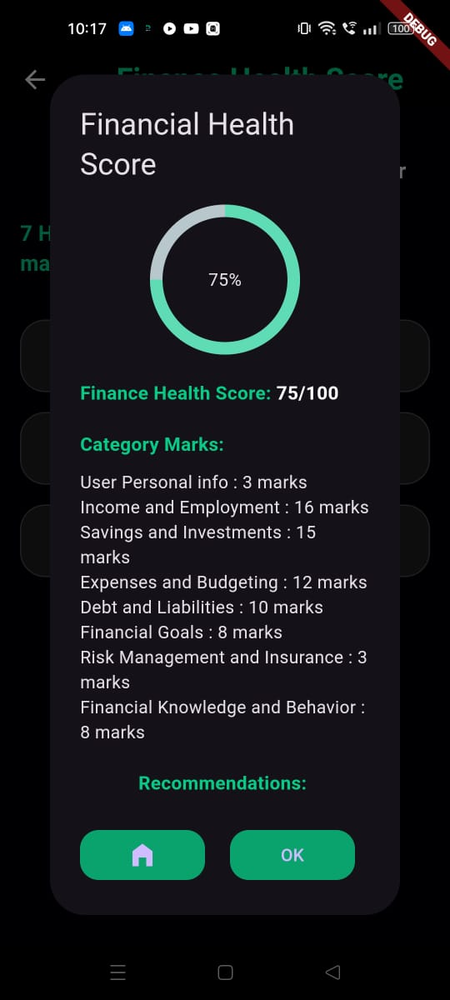
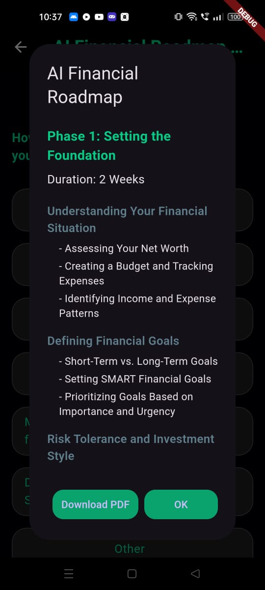
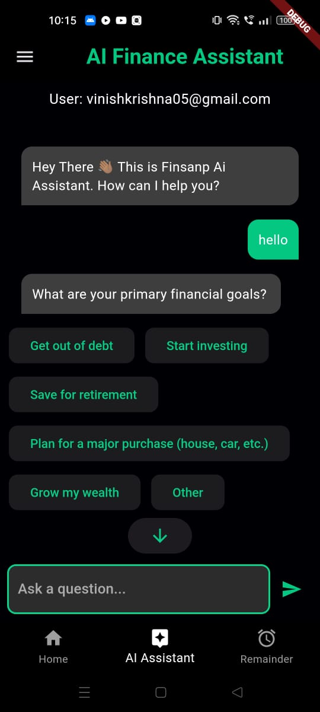
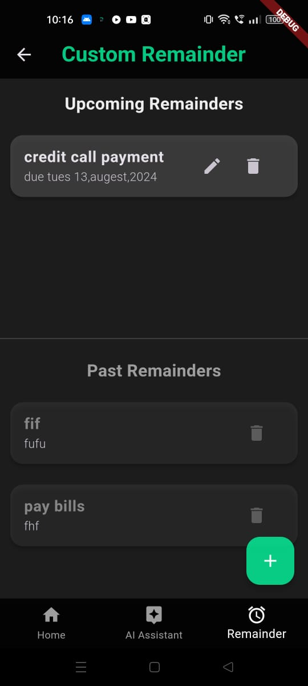

# FinSnap: Your AI-Driven Financial Companion




FinSnap is an AI-powered financial health app designed to help users understand and improve their financial well-being. By analyzing spending habits, saving patterns, investments, and debt levels, FinSnap provides a personalized financial health score along with actionable recommendations.

## 🚀 Features

- **Personalized Financial Health Score**: Calculate your financial health score based on your spending, savings, investments, and debts.
- **Personalized AI Roadmap generator**: Get your personalized AI financial Roadmap based on user's info.
- **AI-Driven Recommendations**: Receive customized recommendations to improve your financial habits and overall financial health.
- **Interactive Quiz**: Engage with a series of questions designed to assess various aspects of your financial life.
- **Custom Notifications**: Stay informed with real-time updates and alerts tailored to your financial interests and goals.
- **Interactive Chat Interface**: Engage with FinSnap's AI through an intuitive chat interface, optimized for all screen sizes.

## 🎨 App Theme & Styling

FinSnap features a sleek and modern UI with a dark theme that emphasizes clarity and ease of use. The app uses a consistent color palette for a cohesive look and feel:

- **Primary Color**: #1A1A1A (Dark Gray)
- **Accent Color**: #00FF7F (Green)
- **Text Color**: #FFFFFF (White)
- **Button Color**: #2A9D8F (Teal)

## 🛠️ Getting Started

### Prerequisites

- [Flutter](https://flutter.dev/docs/get-started/install) installed on your local machine.
- Dart SDK
- A valid [Google Gemini API key](https://cloud.google.com/ai/gemini)

### Installation

1. **Clone the repository:**

    ```bash
    git clone https://github.com/vasan-rj/FinSnap-V1.git
    cd finsnap
    ```

2. **Install dependencies:**

    Connect device through android emulator or physical device USB debugging.
    ```bash
    
    flutter pub get
    ```

3. **Configure the API Key:**

    Replace the placeholder in `lib/services/gemini_service.dart` with your actual Google Gemini API key.

    ```dart
    final apiKey = 'YOUR_GOOGLE_GEMINI_API_KEY';
    ```

4. **Run the app:**

    ```bash
    flutter run
    ```

## 📱 App Screenshots

<div style="display: flex; flex-direction: row; flex-wrap: wrap; gap: 10px;">
  <div style="flex: 1 1 300px; text-align: center;">
    <h3>Home Screen</h3>
    
  </div>
  <div style="flex: 1 1 300px; text-align: center;">
    <h3>Quiz Screen</h3>
    
  </div>
  <div style="flex: 1 1 300px; text-align: center;">
    <h3>Result Screen</h3>
    
  </div>
  <div style="flex: 1 1 300px; text-align: center;">
    <h3>Finance Health Score Recommendation</h3>
    
  </div>
  <div style="flex: 1 1 300px; text-align: center;">
    <h3>AI Assistant Screen</h3>
    
  </div>
  <div style="flex: 1 1 300px; text-align: center;">
    <h3>Custom Reminder Screen</h3>
    
  </div>
</div>

## 📖 How It Works

1. **User Interaction**: The user engages with a series of questions in a quiz format.
2. **Data Collection**: The app collects the user's responses and processes them.
3. **API Call**: The collected data is sent to the Google Gemini API.
4. **AI Analysis**: The API analyzes the data and calculates the financial health score.
5. **Results**: The app displays the score and provides actionable recommendations.

## 📚 Documentation

- [Flutter](https://flutter.dev/docs) - Learn more about the framework used.
- [Google Gemini API](https://cloud.google.com/ai/gemini) - Explore the AI capabilities powering FinSnap.

## 📝 License

This project is licensed under the MIT License - see the [LICENSE](LICENSE) file for details.

## 👥 Contributors


## 📧 Contact

For any inquiries or support, please reach out via [contact.finsnap@gmail.com](mailto:contact.finsnap@gmail.com).

## 📁 Project Structure

```
FinSnap/
│
├── lib/
│   ├── models/
│   │   ├── custom_chat_message.dart
│   │   ├── custom_chat_quiz_model.dart
│   │   └── financial_health_score_model.dart
│   │
│   ├── screens/
│   │   ├── homepage.dart
│   │   ├── chat_interface.dart
│   │   └── quiz_screen.dart
│   │
│   ├── services/
│   │   ├── gemini_service.dart
│   │   └── financial_score_service.dart
│   │
│   ├── widgets/
│   │   ├── custom_chat_bubble.dart
│   │   ├── quiz_option_button.dart
│   │   └── scroll_down_button.dart
│   │
│   ├── main.dart
│   └── app_theme.dart
│
└── README.md
```

## 💡 Gemini Model Configuration

The Gemini model is configured to process financial data and return a personalized financial health score along with recommendations. Here's how it's set up:

```dart
final model = GenerativeModel(
  model: 'gemini-1.5-pro',
  apiKey: apiKey,
  generationConfig: GenerationConfig(
    temperature: 0.7,
    topP: 0.85,
    topK: 20,
    maxOutputTokens: 300,
    responseMimeType: 'application/json',
  ),
  systemInstruction: Content.system("""
    You are a Personalized Financial Health Score Predictor. Your goal is to analyze the user's financial information to provide a personalized financial health score and recommendations.
    ...
  """),
);
```

Here's the updated "Contributing" section with instructions for contributing via a new branch:

---

## 🤝 Contributing

We welcome contributions from the community! To get started, follow these steps:

1. **Clone the repository:**

    ```bash
    git clone https://github.com/vasan-rj/FinSnap-V1.git
    cd FinSnap-V1
    ```

2. **Create a new branch for your changes:**

    ```bash
    git checkout -b your-feature-branch
    ```

3. **Make your changes and commit them:**

    ```bash
    git add .
    git commit -m "Describe your changes here"
    ```

4. **Push your changes to GitHub:**

    ```bash
    git push origin your-feature-branch
    ```

5. **Open a Pull Request:**

    Go to the [GitHub repository](https://github.com/vasan-rj/FinSnap-V1) and open a new Pull Request from your feature branch to the main branch. Provide a description of your changes and why they should be merged.

Thank you for your contributions!

---

Feel free to adjust the instructions based on your preferred workflow or any additional guidelines you might have.


## 🗨️ Acknowledgements

Special thanks to the Google Gemini team for their powerful AI models and to the Flutter community for their support and contributions.


Made with ❤️ using <strong>Flutter, Firebase  & Google Gemini.</strong>
